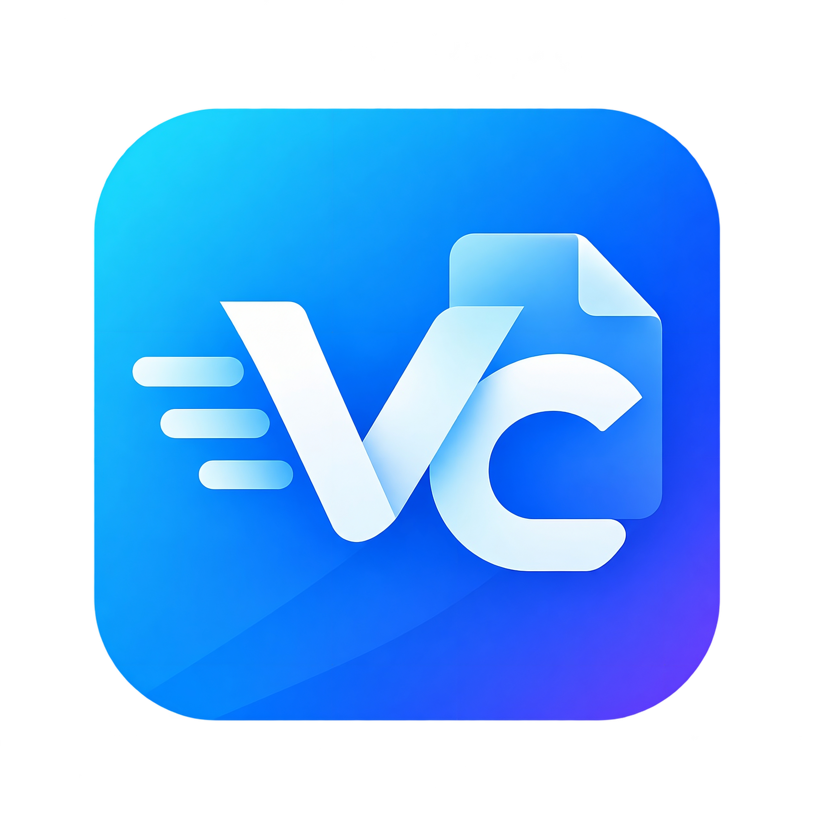

<div align="center">



# VelocityCopy

### A faster, smarter, and cleaner way to copy and move files on Windows 11.

**Simple when you need it. Powerful when you want more.**

<br>

</div>

## What is VelocityCopy?

VelocityCopy is a modern file-copying experience designed to feel at home on Windows 11.

The goal is simple: make copying and moving files **fast, clear, and effortless** without filling the screen with unnecessary controls.

Drop your files, choose where they should go, and let VelocityCopy handle the rest.

## Designed around simplicity

VelocityCopy is being designed as a compact companion to Windows rather than a large file manager.

- **Drag & drop** files and folders directly into VelocityCopy.
- Choose the **destination** before the copy begins.
- Decide whether to **keep the original folder** or copy its contents directly into the destination.
- See the entire operation through **one clean progress bar**.
- Expand the window only when you want to see **what is still waiting to be copied**.
- Keep multiple copy operations organized in a **simple queue**.
- **Pause, resume, skip, stop, or cancel** without losing control of the transfer.
- **Save and load copy queues** when you want to continue later.

## Made to feel like Windows 11

The interface is planned around the visual language of Windows 11: compact, familiar, minimal, and focused on the task in front of you.

The main view stays small and clean. Extra information remains hidden until you ask for it.

```text
┌──────────────────────────────────────────┐
│ VelocityCopy                         ▾   │
│ Copying 8,421 files                      │
│ ████████████████████░░░░░░  72%         │
│ 684 MB/s · 1 min 42 s                    │
│                                          │
│   Pause   Skip   Stop   Cancel      ⋯    │
└──────────────────────────────────────────┘
```

Open the details only when you need them:

```text
┌──────────────────────────────────────────┐
│ 2,318 files remaining · 46.2 GB          │
│                                          │
│ movie.mkv                         8.3 GB  │
│ backup.zip                        4.1 GB  │
│ IMG_8721.CR3                       82 MB  │
│ Documents                     1,204 items │
└──────────────────────────────────────────┘
```

## Smart drag & drop

VelocityCopy is intended to make drag-and-drop copying more useful than a simple "copy here" action.

When you drop something into the app, you will be able to choose how it should arrive at the destination.

For example:

```text
Source
D:\Photos\Vacation\

Destination
E:\Backup\

Keep original folder
E:\Backup\Vacation\...

Copy contents only
E:\Backup\...
```

The choice stays clear without turning a simple copy into a complicated setup process.

## One copy. One progress view.

Even when several items are waiting in the queue, VelocityCopy keeps the main window focused on the overall operation.

You see one progress bar for the complete copy. The detailed queue and remaining files stay available behind the expandable view.

## Project principles

**Fast**  
Copying should feel immediate and responsive.

**Lightweight**  
VelocityCopy should stay out of the way when you are not using it.

**Simple**  
The most common actions should never require navigating through complicated menus.

**Familiar**  
It should look and behave like it belongs on Windows 11.

**In control**  
Pause, resume, skip, stop, cancel, save, and continue when you want.

## Project status

> **VelocityCopy is currently in early development.**

The project is being built from the ground up. The current repository represents the beginning of the product, and features shown here describe the intended experience rather than a finished release.

### Initial direction

- Compact Windows 11-style interface
- Drag & drop workflow
- Smart destination choices
- Single overall progress bar
- Expandable remaining-file list
- Copy queue
- Pause and resume
- Skip, stop, and cancel controls
- Save and load queues
- Clear conflict handling
- Windows Explorer integration

## Windows

VelocityCopy is being created primarily for **Windows 11**.

## License

VelocityCopy is available under the [MIT License](LICENSE).

---

<div align="center">

**VelocityCopy**  
*Copy less complicated.*

</div>
